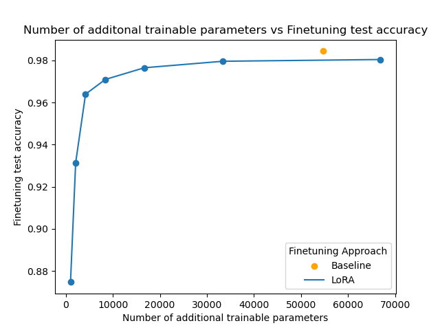

# LoRA from Scratch
Implements Low-Rank Adaptation(LoRA) Finetuning from scratch. 

This notebook was a small project to learn more about LoRA finetuning. It implements LoRA from scratch primarily using the [paper](https://arxiv.org/abs/2106.09685) as a guide. I found that on a simple model, I could achieve 97.9% of the performance of normal finetuning with as little as 7.7% of the trainable weights compared to the traditional approach, which is pretty incredible!

# Experimental Results
| model                              |approx. number of trainable parameters  | test accuracy | percent trainable parameters relative to baseline | percent test accuracy relative to baseline |
|------------------------------------|----------------------------------------|---------------|---------------------------------------------------|--------------------------------------------|
| baseline - whole model finetune    | 54700                                  | 0.984         |                                              100% |                                       100% |
| LoRA rank = 1                      | 1000                                   | 0.875         |                                              1.8% |                                      88.9% |
| LoRA rank = 2                      | 2100                                   | 0.931         |                                              3.8% |                                      94.6% |
| LoRA rank = 4                      | 4200                                   | 0.964         |                                              7.7% |                                      97.9% |
| LoRA rank= 8                       | 8400                                   | 0.971         |                                             15.4% |                                      98.6% |
| LoRA rank = 16                     | 16700                                  | 0.977         |                                             30.5% |                                      99.2% |
| LoRA rank = 32                     | 33400                                  | 0.980         |                                             61.1% |                                      99.5% |
| LoRA rank = 64                     | 66900                                  | 0.980         |                                              122% |                                      99.6% |

